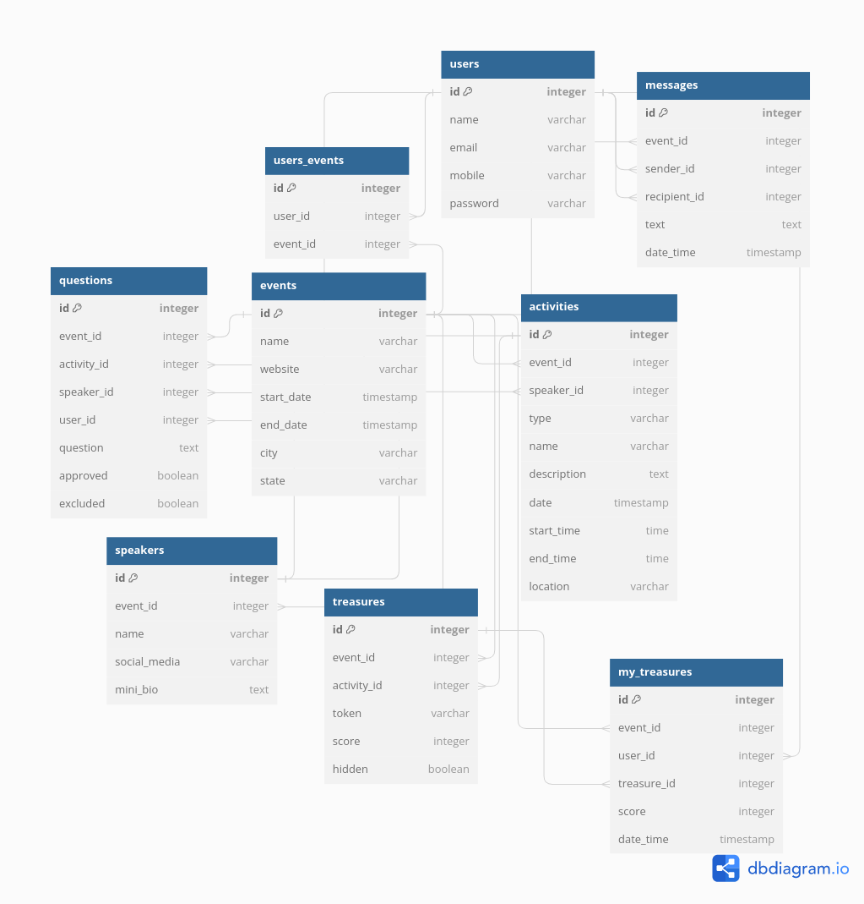

# Apollo23 - Grupo 7


Projeto do Grupo 7 - Apollo 23, da Hackweek do programa +Devs2Blu 2023.

Este repositório contém o código-fonte de um servidor desenvolvido em Spring Boot, que faz parte de um **MVP** para o gerenciamento de eventos.
O servidor oferece uma API que permite interações com o sistema de gerenciamento de eventos.

---

## Problema

Levamos em consideração um problema que a Blusoft enfrenta:

* Pessoas que se inscrevem para palestras gratuitas e acabam não indo, o que gera diversos transtornos.

### Engajamento em eventos

Organizar eventos de tecnologia é uma tarefa desafiadora, que envolve diversos aspectos, desde a logística e a programação até o engajamento dos participantes. Com o crescimento constante da indústria de tecnologia, a realização de eventos bem-sucedidos tornou-se essencial para a disseminação de conhecimento, a promoção de networking e o fortalecimento das comunidades de tecnologia. No entanto, muitas vezes, as equipes de organização enfrentam obstáculos que podem dificultar a comunicação eficiente e o engajamento dos participantes.

## Solução

Incluir uma camada de gameficação e iteração ao se inscrever em uma palestra.

* O usuário irá ler QRCodes durante a palestra, essas leituras geram pontos que podem ser utilizados da forma que o organizador achar melhor (sorteios, descontos, prioridade em eventos). Além disso, o histórico de leituras cria uma base de dados que poderá ser utilizada para definição de estratégias.
* O usuário poderá postar perguntas que serão escolhidas para serem feitas ao palestrante. Como as perguntas ficam visíveis no aplicativo, é possível que o palestrante já se prepare baseado no que a platéia tem interesse em saber.

---

## [Repositório Flutter](https://github.com/Everton-WS/apollo23-flutter)

---

## Instalação e Uso

### Executando o Projeto Maven Localmente

Siga os passos abaixo para executar o projeto Maven localmente. Certifique-se de que o Java 17 ou superior esteja instalado em seu sistema.

1. **Java Development Kit (JDK) 17 ou superior**
    - Verifique se o JDK 17 está configurado em sua variável de ambiente `JAVA_HOME`.
    - Caso não, [siga esses passos para instalação](docs/readmes/JdkInstallation.md).
2. **Clone o Repositório:**
   ```shell
   git clone https://github.com/Everton-WS/apollo23-java.git
   ```
3. **Acesse a pasta do projeto**
   ```shell
   cd apollo23-java
   ```
4. **Execute o Projeto com o Maven Wrapper**
   O projeto já inclui o Maven Wrapper, que permite que você execute comandos Maven sem a necessidade de instalar o Maven globalmente. Execute o seguinte comando para construir e executar o projeto:
    ```shell
   ./mvnw clean package spring-boot:run
   ```
5. **Acesse a Aplicação** em `http://localhost:8080/api`
    
---

## Documentação

### Modelo Entidade-Relacionamento


---

## Requisitos

#### Funcionais
* O sistema deverá ler os QR codes
* O sistema deverá informar ao usuário se aquele QR code já foi lido
* O sistema deverá informar ao usuário se aquele QR code é válido
* O sistema deverá armazenar as perguntas feitas pelos usuários

#### Não funcionais
* Front-end será desenvolvido em Flutter (Mobile/Android)
* Back-end será desenvolvido em Java utilizando Spring
* Persistência dos dados será feita utilizando banco de dados Postgres

## Equipe
- Allan Zimmermann
- Antônio Carlos Schwanke Zipf
- Endrigo Gustavo de Oliveira Knetsch
- Everton Wesley da Silva
- João Vinícius Rosá
- Lucas Raulino dos Santos
- Tiago Martins Speckart
- Vinícius dos Santos Guimarães

